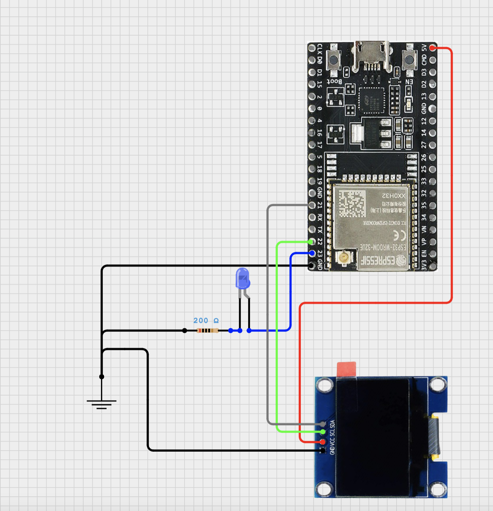

# Paginator

A gadget that flashes an LED when you get paged.

## Getting started

Open Arduino IDE.

Go to Library Manager and install:
- Adafruit SSD1306

Open `paginator.ino` and upload to ESP32.